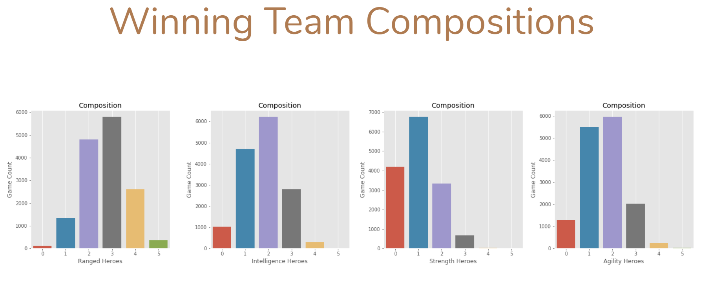
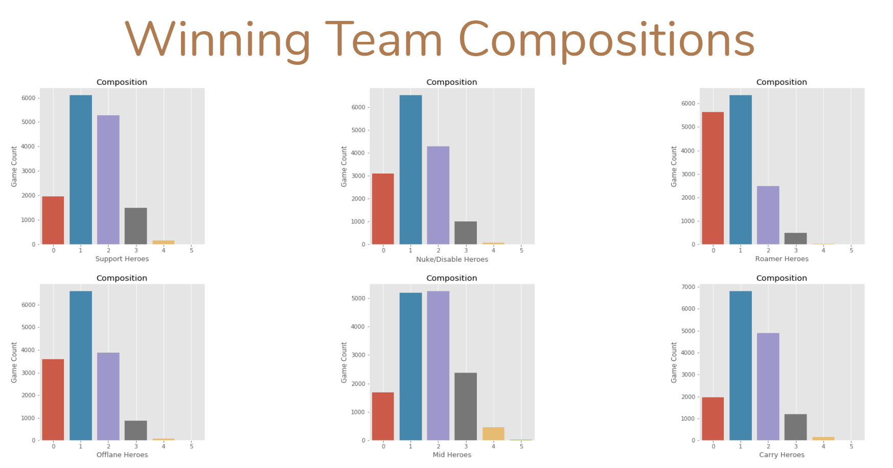

# In Zeus We Trust!

## Introduction

In this project, I'm tried to predict the outcome of a Defense of the Ancients (DOTA) match based characters chosen heroes. DOTA is an online multiplayer video game, each game consists of 10 players divided between two teams (Sentinal and Scourge), to eliminate the opposing's team base. In the game, there are about 100 heroes to choose from, each with its unique abilities and each hero can only be picked by one player in a game.

DOTA is a highly competitive and complicated game with a big esports scene. Each character can play different roles in different games and the outcome of the match is highly dependet on the players controlling the characters. Since no other info was given about the game or players, I was force to assume all of the players are of similar skill level.

_For those interested in a shorter recap:_ [_Presentation Slides_](https://docs.google.com/presentation/d/1AKZJis6KyVOaiBVipZDst1Y8gfjZb7vtTchXU-Y1Vos/edit?usp=sharing/ "Presentation")

## Technical Description

The dataset was released by [HackerRank](https://www.hackerrank.com/challenges/dota2prediction/problem/ "HackerRank") as a challenge.
The dataset contains observations from 15000 matches in text file. Each row consists of 10 heroe names (first 5 Sentinal, then 5 Scourge) and the outcome of the game (1 for Sentinal victory, 2 for Scourge) separated by commas.

The majority of the code was written in Jupyter Notebooks using Python. Additionally, I used [VSCode](https://code.visualstudio.com/ "VSCode") to assist in creating the helper functions module and Readme. The project is publicly accessible can be found on my [GitHub](https://github.com/DaggerForce/Dota_Victory_Classification "GitHub").

For data manipulation and EDA, I utilized [Pandas](https://pandas.pydata.org/pandas-docs/stable/index.html/ "Pandas"), [Numpy](https://www.numpy.org/ "Numpy"), and [Beautiful Soup](https://www.crummy.com/software/BeautifulSoup/bs4/doc/ "Beautiful Soup"). For data analysis, I utilized [Scipy](https://www.numpy.org/ "Scipy"), [Sklearn](https://scikit-learn.org/stable/ "Sklearn"), and [XGBoost](https://xgboost.readthedocs.io/en/latest// "XGboost"). For the visualizations, I utilized [Matplotlib](https://matplotlib.org/ "Matplotlib") and [Seaborn](https://seaborn.pydata.org/introduction.html/ "Seaborn")

## Table of Contents

* Exploring the Dataset
  * [Preparing Data](#Preproccesing)
  * [Feature Engineering](#feature-engineering)
* Models
  * [KNN](#KNN)
  * [Decision Tree](#decision-Tree)
  * [Random Forest](#random-forest)
  * [AdaBoost](#adaboost-(most-accurate))
  * [XGBoost](#xgboost)
  * [Logistic Regression](#logistic-regression)
  * [Support Vector Machine](#svm)
* [Summary](#summary)

### Preprocessing

I began by looking for fragmented observations in the dataset and then started to manipulate it for modeling purposes. As previously mentioned, each row consisted of both the winning team, the losing team and the outcome. Because each observation contained both a winning team and a losing team, I wasn't worried about class imbalance. However, I was curious if either team won significantly more times than the other.

I started by splitting the original data-frame into 4 smaller ones, the winning teams from team Sentinal, the winning teams from team Scourge, and the losing teams. I then attributed the outcome '1' for winning, '0' for losing and continued by creating a dummy variable for each character.

### Feature Engineering

Since I used to play the original DOTA on Warcraft 3 platform, I knew this game is not simple. Each character has its strengths and weaknesses, winning the game is a group effort, and each player plays a different role based on the character they chose.
Based on my domain knowledge I added features concerning the main character’s main attribute (Strenght, Agility or Intelligence), attack type (Ranged or Melee), role (Support, Carry, Nuker, Disabler, and Roamer) and recommended lane (Mid, Off-lane). A good team is balanced and has different characters that together fill as many positions. To get the most accurate list of heroes sorted by their attack type (melee or ranged) and main attribute (Strength, Agility, or Intelligence), I scraped the [DOTA2 Wiki page](https://dota2.gamepedia.com/Dota_2_Wiki "DOTA2 Wiki"). Additionally, I calculated the win/loss ratio for every character
and created features for the top 15 performers and the worse 15 performers (according to the win/loss ratio).

In the end, I combined the 13 new features with the data frame that contained the dummy variables for every character and scaled the values.

## Modeling

### KNN

I've selected the K-Nearest Neighbor (default value of 5 neighbors) algorithm to act as a baseline model.
The model performed slightly better than a random guess for binary classification. with a recall of 54.48%,
accuracy of 52.47%, and F1 Score of 53.22%

I then optimized the model by adjusting the amount of neighbors (optimal neighbors = 7) to 54% recall, 52.97% accuracy, and an F1 score of 53.55%.

### Decision Tree

I began by exploring what max depth I should use to avoid overfitting of the model. The first decision tree (max depth = 6) predicted with 58.87% recall, 57.05% accuracy, and an F1 score of 57.95%. Hyperparameter optimization using a random grid search yielded a decrease in the chosen metrics. With the best parameters (max_depth = 8, max_features = 8, min_samples_leaf = 9, min_samples_split = 579), the recall, accuracy, and F1 score decreased to 54.48%, 56.37%, and 55.34% respectively.

### Random Forest

With default hyperparameters, Random Forest performed under the baseline two out of the three metrics I focused on (recall = 45.15%, accuracy = 53.88%, and F1 = 49.28). However, after optimizing the hyperparameters using random search (max_depth = 8, max_features = 8, min_samples_leaf = 9, min_samples_split = 579), recall, accuracy, and the F1 score increased to 54%, 52.97%, and 53.55% respectively.

### AdaBoost (Most Accurate)

AdaBoost with default hyperparameters was the most accurate out of all models up until that moment (recall = 56.8, accuracy = 56.73, and F1 = 56.57). Additionally, after optimizing the hyperparameters using grid sesarch (learning_rate = 0.1, number of estimators = 300), the recall, accuracy, and F1 score increased to 57.51%, 57.45%, and 57.29% respectively.

### XGBoost

XGBoost with default hyperparameters was slightly more accurate than AdaBoost (recall = 56.87%, accuracy = 57.07%, and F1 = 56.79%). However, after optimizing the hyperparameters using grid sesarch (learning_rate = 0.1, max_depth = 5, min_child_weight = 5, number of estimators = 50, subsample = 0.7), despite  recall, accuracy, and F1 score increasing to 57.51%, 57.45%, and 57.29%. AdaBoost boost was most accurate.

### Logistic Regression

Optimized logistic regression model (C = 1, penalty = 'l1'), performed almost as well as Ada/XGBoost with recall, accuracy, and F1 score of 57.71%,  56.6%, and 56.89% respectively.

### SVM

Using Principal Component Analysis (PCA), I reduced the dimensionality of the dataset to 15 dimensions. Then, I ran SVM using the polynomial and sigmoidal kernel tricks, both performed under the baseline (50% — 51%). Instead of using the ‘linear’ kernel trick and because my dataset contains a large number of observations, I preferred using LinearSVC. LinearSVC returned the most accurate model out of the different support vector machine models. The model performs with 55.89% recall, 56.43% accuracy, and an F1 score of 56.04% with regularisation parameter equal to 1 (C = 1).

## Summary

Even though I was able to outperform the baseline classifying accuracy (52.47%), unfortunately, I was unable to increase the classifying accuracy by over 57%. AdaBoost proved the most accurate algorithm in this case. However, the results were not substantially better than XGBoost and Linear Regression. Sadly, some of the features I created based on domain knowledge did not improve the classifying accuracy. Thus, I excluded them from the models.
To improve the models, I would go back to the EDA process and add features regarding winning and losing team compositions. Winning teams are usually more balanced according to my knowledge of the game.  You need a mix of heroes with different main attributes. Teams with 5 Intelligence, Strength or Agility heroes and teams of 5 melee heroes will more likely lose the match.

